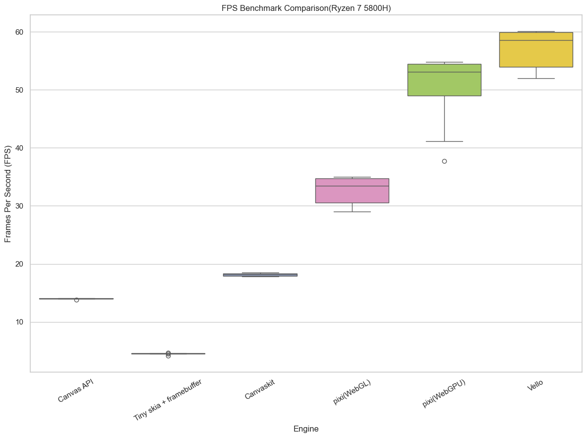
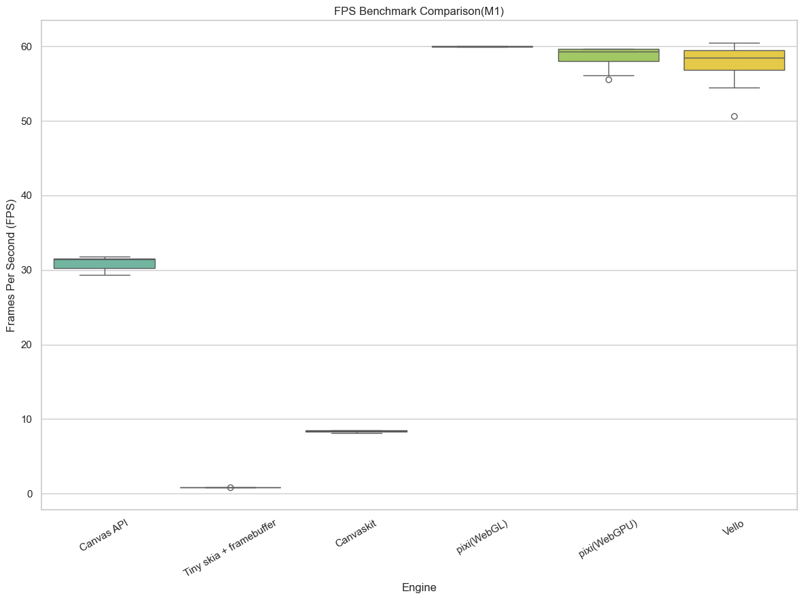

# Browser 2D Rendering Engine Showdown

- Comparison of 2D rendering engines that run on browsers
- Comparing the performance of rendering engines is difficult, so this is only a benchmark from a certain perspective
- Compare FPS by rendering particles bouncing off walls on Canvas
- The implementation is straightforward, so the results of optimization for each library are unknown
- The following box plots were verified using the following two types

```
800px x 600px canvas size、50,000 particles (4px)
MX x86_64 6.14.10-2-liquorix-amd64
AMD Ryzen 7 5800H with Radeon Graphics
```



```
4096px x 2160px canvas size、150,000 particles (4px)
macos Sequoia 15.5
M1 macbook air 
```


